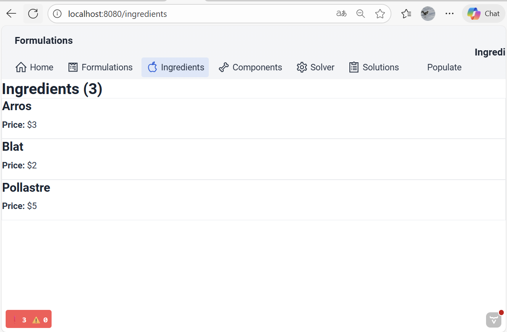
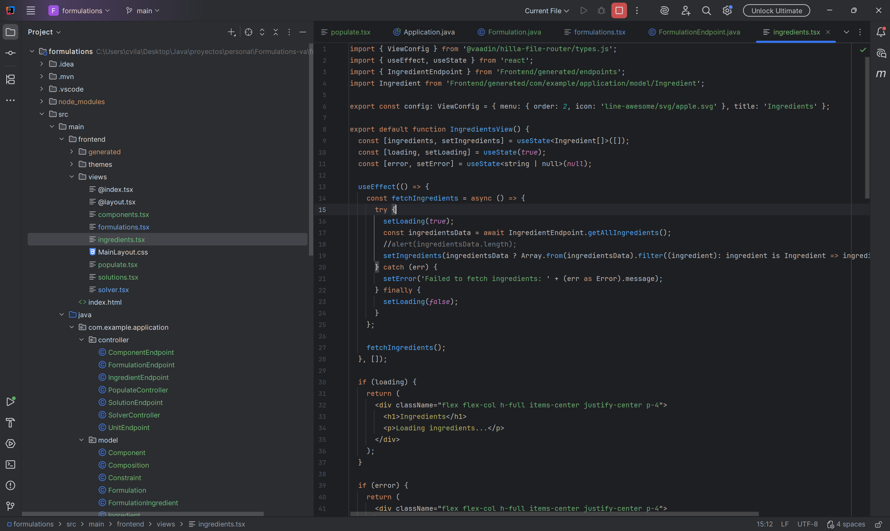

# Formulations-va

Here as part of the personal project in the Fullstack Java Course we ara converting the "Formulations-sb" repository/app to Java Vaadin with React.

It tries to find the minimum cost solution for the animal food formulation problem with some constraints.

For the moment we populate the initial data in the H2 database.

We execute the app and we can view the data, execute the solver and see the results:

 

